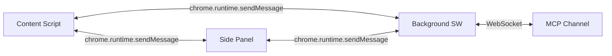
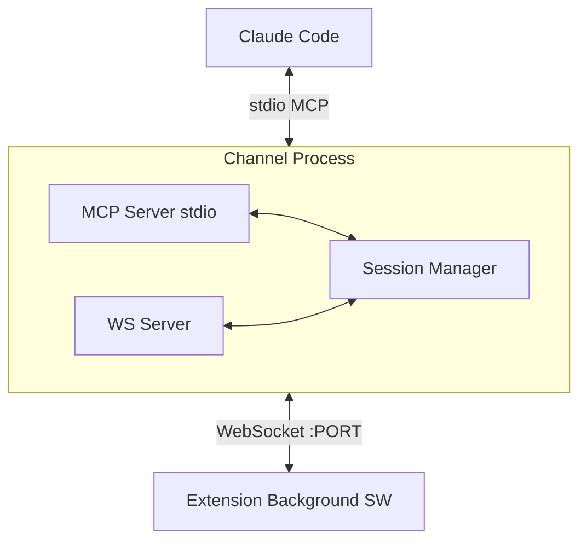

## Context

On développe une extension navigateur (Chrome + Firefox) qui permet d'envoyer du feedback visuel sur des éléments DOM à Claude Code via un MCP channel. Le système s'inspire du markdown-reader qui utilise un pattern similaire (Unix socket + MCP stdio + notifications bidirectionnelles), mais adapté au contexte navigateur avec WebSocket.

Le projet part de zéro — pas de code existant.

**Contraintes :**
- Manifest V3 (Chrome impose MV3, Firefox le supporte aussi)
- Service Worker background (pas de persistent background page)
- Side Panel API Chrome / Sidebar Action Firefox
- Pas de framework frontend (vanilla JS, comme le markdown-reader)

## Goals / Non-Goals

**Goals :**
- Permettre de sélectionner un élément DOM et envoyer un commentaire à Claude Code
- Capturer des screenshots et les envoyer à Claude Code
- Recevoir les réponses de Claude dans le Side Panel
- Supporter le highlight distant d'éléments par Claude
- Fonctionner sur Chrome et Firefox

**Non-Goals :**
- Sélection multi-éléments
- Mapping automatique URL → fichier source
- Persistance des annotations entre sessions
- Support Safari

## Decisions

### D1 : WebSocket pour le transport Extension ↔ MCP Channel

**Choix :** WebSocket sur localhost (ws://localhost:PORT)

**Alternatives considérées :**
- **Native Messaging** : fiable mais nécessite un binaire natif installé séparément, complexifie le déploiement
- **Fichier partagé (watch)** : hacky, latence, pas de vraie bidirection
- **Réutilisation du socket Unix du markdown-reader** : couple les deux projets

**Rationale :** WebSocket est natif dans les Service Workers, ne nécessite pas d'installation de binaire hôte, et supporte naturellement la bidirection. Le MCP channel TypeScript peut facilement exposer un serveur WS en parallèle du stdio.

### D2 : Side Panel Chrome / Sidebar Action Firefox

**Choix :** L'UI principale vit dans le Side Panel (Chrome) / Sidebar (Firefox)

**Rationale :** Persiste entre les navigations, DOM isolé (pas de conflit CSS avec le site), et le content script reste minimal (juste les overlays). Le chat thread et les contrôles vivent dans le panel.

**Divergence navigateurs :** Chrome `chrome.sidePanel.setOptions()` vs Firefox `browser.sidebarAction`. Abstraction via un module `sidebar-compat.js` qui expose une API unifiée.

### D3 : Architecture 3 acteurs dans l'extension

**Choix :**

- **Content Script** : inspecteur DOM + overlays de highlight. Injecté dans la page.
- **Side Panel** : UI chat, boutons d'action, état. Isolé dans le panel.
- **Background Service Worker** : WebSocket client, routing des messages, screenshot API.

**Rationale :** Séparation claire des responsabilités. Le Background SW est le seul à avoir la connexion WebSocket (un seul point de connexion). Le Content Script est minimal pour réduire l'impact sur les pages.

### D4 : webextension-polyfill pour la compatibilité

**Choix :** Utiliser `webextension-polyfill` pour unifier `chrome.*` / `browser.*`

**Rationale :** Permet d'écrire un seul codebase promise-based. Les divergences non couvertes (Side Panel vs Sidebar) sont gérées par une abstraction maison minimale.

### D5 : Fingerprint multi-signaux

**Choix :** Envoyer un bundle de signaux (selector, outerHTML tronqué, textContent, attributes, component React/Vue, context parent/sibling) plutôt qu'un seul identifiant.

**Rationale :** Aucun signal unique ne suffit pour tous les cas (HTML statique, SPA React, etc.). Claude Code peut utiliser le signal le plus pertinent selon le contexte. On itère si nécessaire.

### D6 : MCP Channel TypeScript avec WS Server intégré

**Choix :** Un seul processus TypeScript qui expose :
- Le MCP stdio (vers Claude Code)
- Un serveur WebSocket (vers l'extension)

**Rationale :** Même pattern que le markdown-reader (un processus = MCP + IPC). Le WS server remplace le Unix socket. Lancé via `claude-code --mcp`.

### D7 : Port WebSocket configurable

**Choix :** Port par défaut (ex: 9420) configurable via variable d'environnement `FEEDBACK_WS_PORT`.

**Rationale :** Évite les conflits de port. L'extension stocke le port dans `chrome.storage.local` et le rend configurable dans les options.

### D8 : Reconnexion automatique du WebSocket

**Choix :** Le Background SW implémente un reconnect avec backoff exponentiel (1s, 2s, 4s, max 30s).

**Rationale :** Le Service Worker Chrome peut être tué/relancé par le navigateur. La connexion WS doit se rétablir automatiquement. Le Side Panel affiche l'état de connexion (🟢 connecté / 🔴 déconnecté).

### D9 : Vanilla JS sans build step

**Choix :** Pas de bundler, pas de framework. JavaScript vanilla pour l'extension.

**Rationale :** Cohérent avec le markdown-reader. Simple à débugger. Le polyfill est chargé comme script ES module. Le channel TypeScript utilise `tsx` pour l'exécution (comme le markdown-reader).

### D10 : Screenshot via chrome.tabs API

**Choix :** `chrome.tabs.captureVisibleTab()` appelé depuis le Background SW.

**Rationale :** API standard, supportée Chrome + Firefox (via polyfill). Capture le viewport visible. L'image est envoyée en base64 PNG via WebSocket.

## Risks / Trade-offs

- **Service Worker lifecycle** : Chrome peut tuer le SW après ~30s d'inactivité. Le WS se ferme. → Mitigation : reconnexion auto + keep-alive ping si nécessaire.
- **Taille des screenshots** : base64 PNG d'un viewport peut faire 1-5 MB. → Mitigation : compression JPEG optionnelle, ou redimensionnement. À évaluer en pratique.
- **CSP restrictive** : certains sites bloquent les scripts injectés. → Mitigation : scope = dev local, rarement un problème.
- **Side Panel API récente** : Chrome 114+ (mai 2023). → Acceptable, on ne cible pas les anciens navigateurs.
- **Sidebar Firefox ≠ Side Panel Chrome** : APIs différentes, UX légèrement différente (sidebar Firefox est toujours accessible, le Side Panel Chrome nécessite un click). → Mitigation : abstraction `sidebar-compat.js`.

## Open Questions

- Faut-il un mécanisme de discovery pour le port WS (au lieu d'un port fixe) ? Ex: fichier PID avec le port dans `/run/user/$UID/`.
- Le channel devrait-il supporter plusieurs extensions connectées simultanément (multi-tab) ? Probablement oui, mais à confirmer.
