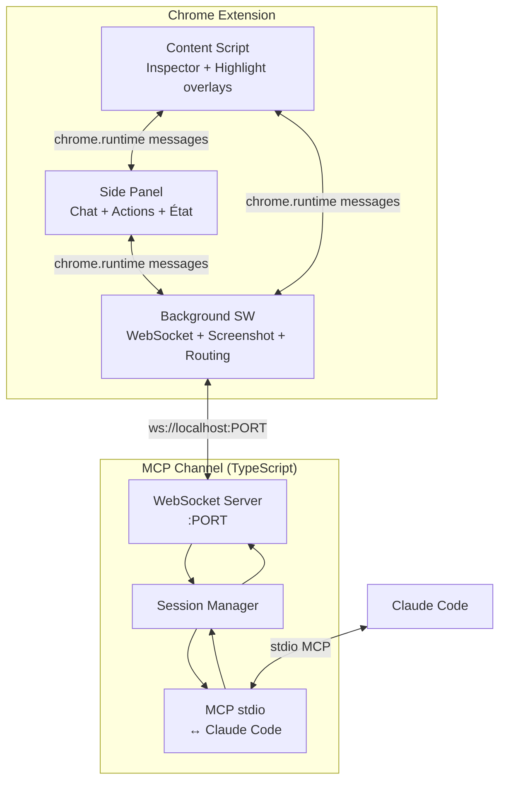

# Browser Feedback Extension

## Résumé

Extension Chrome (Manifest V3) avec Side Panel qui permet d'envoyer du feedback visuel sur des éléments DOM directement à Claude Code via un serveur MCP et une connexion WebSocket. Inspiré du système de feedback du [markdown-reader](../../../markdown-reader/), adapté au contexte navigateur.

## Problème

Quand on développe une interface web, le feedback entre ce qu'on voit dans le navigateur et Claude Code est déconnecté : il faut décrire verbalement quel élément pose problème, copier-coller du HTML, faire des screenshots manuellement. On perd du temps et du contexte.

## Solution

Une extension navigateur qui offre deux actions principales :

1. **Inspect & Comment** — Sélectionner un élément du DOM (inspecteur similaire aux DevTools), ajouter un commentaire, et envoyer le tout à Claude Code avec un fingerprint multi-signaux de l'élément.

2. **Screenshot & Comment** — Capturer la page visible, ajouter un commentaire optionnel, et envoyer à Claude Code.

Claude Code reçoit ces feedbacks via un MCP channel et peut répondre dans le Side Panel. Il peut aussi déclencher un highlight distant sur un élément de la page.

## Architecture



## Composants

### Extension Chrome

#### Content Script (`content/`)
- **Inspecteur DOM** : hover pour highlight, click pour sélectionner. Toggle via message du Side Panel.
- **Highlight overlay** : affiche des overlays sur les éléments (sélection locale + highlights distants envoyés par Claude).
- **Fingerprint extraction** : génère un objet d'identification multi-signaux pour l'élément sélectionné.
- Minimal — pas d'UI complexe, juste des overlays.

#### Side Panel (`sidepanel/`)
- **Bouton Inspect** : active/désactive l'inspecteur DOM dans le content script.
- **Bouton Screenshot** : capture la page visible et permet d'ajouter un commentaire.
- **Chat thread** : affiche les messages envoyés et les réponses de Claude.
- **Session picker** : sélection de la session Claude Code active.
- **Toggle highlights** : ON/OFF global pour les highlights distants.
- **Dismiss unitaire** : chaque highlight distant a un bouton "✕" pour le masquer.

#### Background Service Worker (`background/`)
- **WebSocket client** : connexion persistante vers le MCP channel.
- **Routing** : fait transiter les messages entre content script, side panel, et WebSocket.
- **Screenshot** : utilise `chrome.tabs.captureVisibleTab()`.

### MCP Channel (`channel/`)
- **Serveur TypeScript** lancé via Claude Code (`--mcp`).
- **WebSocket server** (en parallèle du stdio MCP).
- **Outils MCP exposés** :
  - `reply(session_id, message)` — envoyer une réponse vers le Side Panel.
  - `highlight(session_id, selector, label?)` — highlight distant d'un élément.
- **Notifications MCP** (channel → Claude Code) :
  - `element_feedback` — commentaire sur un élément DOM.
  - `screenshot` — capture d'écran avec commentaire.

## Messages

### Extension → MCP Channel

#### `element_feedback`
```json
{
  "type": "element_feedback",
  "url": "http://localhost:3000/about",
  "selector": "main > .card:nth-child(3) > h2",
  "outerHTML": "<h2 class='card-title'>...</h2>",
  "textContent": "Titre de la carte",
  "attributes": {"class": "card-title", "id": null, "data-testid": "card-title"},
  "component": "CardItem | null",
  "context": {"parentTag": "div.card", "prevSiblingTag": "img.card-image"},
  "comment": "Ce titre devrait être en rouge"
}
```

#### `screenshot`
```json
{
  "type": "screenshot",
  "url": "http://localhost:3000/about",
  "image": "data:image/png;base64,...",
  "comment": "Le layout est cassé sur cette page"
}
```

### MCP Channel → Extension

#### `reply`
```json
{
  "type": "reply",
  "session_id": "uuid",
  "message": "J'ai modifié la couleur dans styles.css ligne 12"
}
```

#### `highlight`
```json
{
  "type": "highlight",
  "session_id": "uuid",
  "selector": "main > .card:nth-child(3) > h2",
  "label": "Modifié"
}
```

## Fingerprint d'élément — Stratégie multi-signaux

L'objectif est de donner assez de contexte à Claude Code pour retrouver l'élément dans le code source.

| Signal | Source | Utilité |
|--------|--------|---------|
| `selector` | CSS path unique | Localisation structurelle |
| `outerHTML` | Tronqué ~500 chars | Grep dans le code source |
| `textContent` | Texte visible | Retrouver dans templates/i18n |
| `attributes` | class, id, data-*, role, aria-* | Identifiants dans le source |
| `component` | React fiber / Vue instance (si dispo) | Mapping direct → fichier |
| `context` | Parent + sibling résumé | Désambiguïsation |

Le component React/Vue est un bonus (disponible en dev mode). Pour du HTML statique, les autres signaux suffisent. On itère si nécessaire.

## Structure de fichiers

```
claude-feedback-browser-ext/
├── manifest.json                  # Manifest V3, side_panel, permissions
├── background/
│   └── service-worker.js          # WS client, routing, screenshot
├── content/
│   ├── inspector.js               # DOM hover/click/select
│   ├── highlight.js               # Overlay highlights (local + distant)
│   └── content.css                # Styles des overlays
├── sidepanel/
│   ├── sidepanel.html             # UI
│   ├── sidepanel.js               # Chat, actions, état
│   └── sidepanel.css              # Styles
├── channel/
│   └── feedback-channel.ts        # MCP server + WS server
└── icons/                         # Icônes extension
```

## Non-goals (v1)

- Sélection multi-éléments
- Mapping automatique URL → fichier source
- Support Safari
- Annotations persistantes (les highlights sont éphémères)
- Mode collaboratif multi-utilisateurs
- Intégration avec d'autres AI que Claude Code

## Risques et inconnues

- **Fiabilité du fingerprint** : le multi-signaux peut ne pas suffire pour certains layouts complexes. Mitigation : on itère, et Claude peut toujours demander des précisions.
- **WebSocket reconnection** : le service worker Chrome peut être tué par le navigateur. Il faudra gérer la reconnexion automatique.
- **CSP de certains sites** : le content script injecté peut être limité par les Content Security Policies. Pour du dev local, c'est rarement un problème.
- **Side Panel API** : relativement récente (Chrome 114+), mais stable.
- **Sidebar Firefox vs Side Panel Chrome** : APIs différentes (`browser.sidebarAction` vs `chrome.sidePanel`). Le polyfill ne couvre pas cette différence — il faudra une petite abstraction maison.

## Compatibilité multi-navigateurs

Utilisation de [webextension-polyfill](https://github.com/nicedoc/webextension-polyfill) pour unifier les APIs `chrome.*` / `browser.*` et supporter **Chrome + Firefox** avec le même code.

**Points de divergence à gérer manuellement :**
- **Sidebar** : Chrome `chrome.sidePanel` vs Firefox `browser.sidebarAction` — abstraction dédiée.
- **Manifest** : Chrome Manifest V3 vs Firefox MV3 (légers deltas dans `background.service_worker` vs `background.scripts`).
- **Screenshot** : `chrome.tabs.captureVisibleTab()` est supporté des deux côtés via le polyfill.

## Inspiration

- **markdown-reader** : même pattern MCP channel avec session routing, notifications bidirectionnelles, et reply tool.
- **Chrome DevTools Inspector** : UX de sélection d'élément (hover highlight, click select).
- **Visbug** (extension Chrome) : overlay d'inspection DOM.
